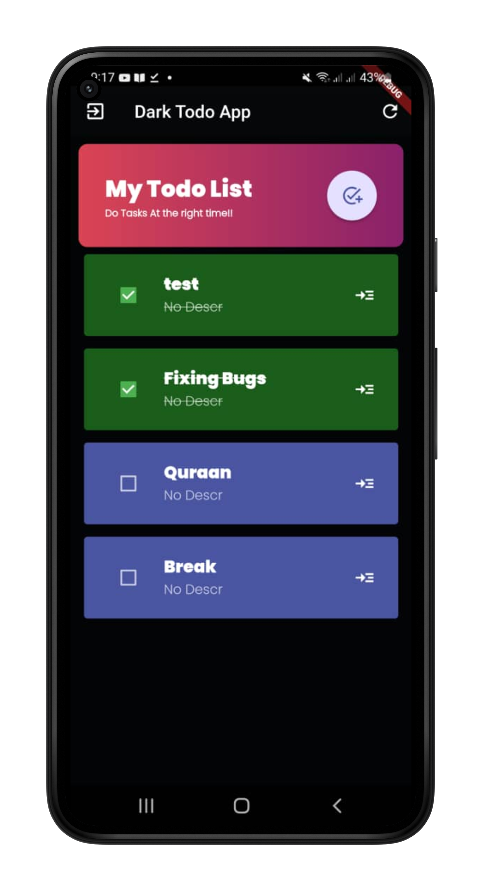
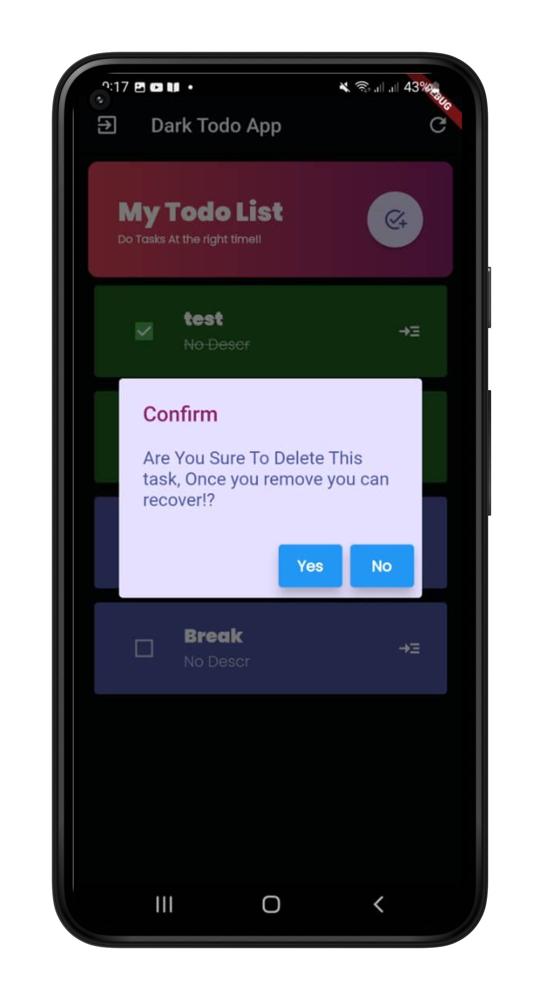
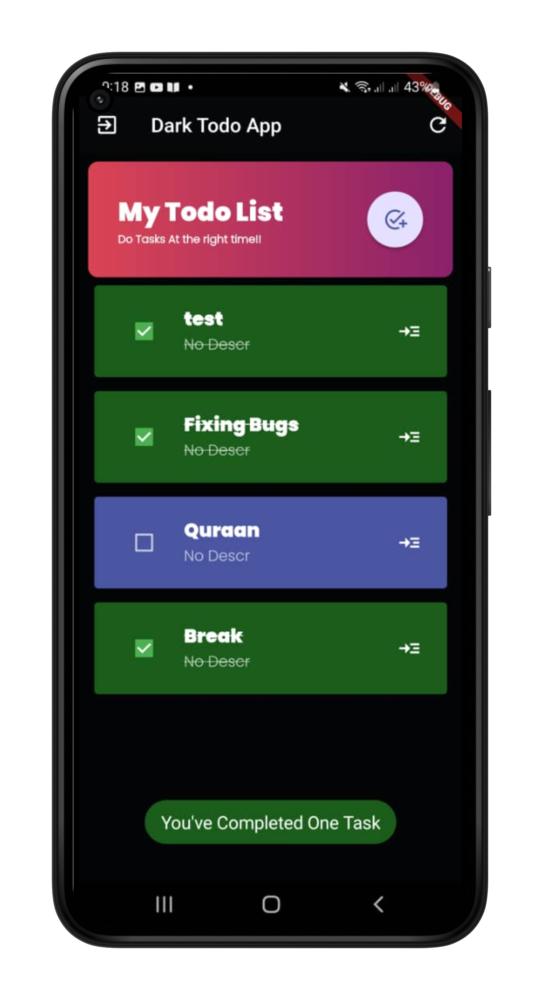

# todo_app
A new Flutter project, TodoApp.

## Getting Started
you can clone this repo by adding this app your own features and your own design, 
all custom designs or custom widgets are in <kdb> lib </kbd> folder,

## Hive 📙
this app uses hive database to store and organize todo data, make sure you've latest flutter sdk version,
visit flutter  main site, and make sure all dependencies are in place, in case erros run this command <kbd> flutter pub get</kbd> in your terminal space

# VISUAL
Solarized dark             |  Solarized Ocean         
:-------------------------:|:-------------------------:
  |  

# Desib

<table>
 <tr>
  <th>Main Page</th>
  <th>Checks</th>
  <th>Notify</th>
 </tr>
  <tr>
    <td></td>
    <td></td>
    <td></td>
  </tr>
 </table>
 
# Help
Email: abdulrahmandev10@gmail.com
source: ENG-CJ

